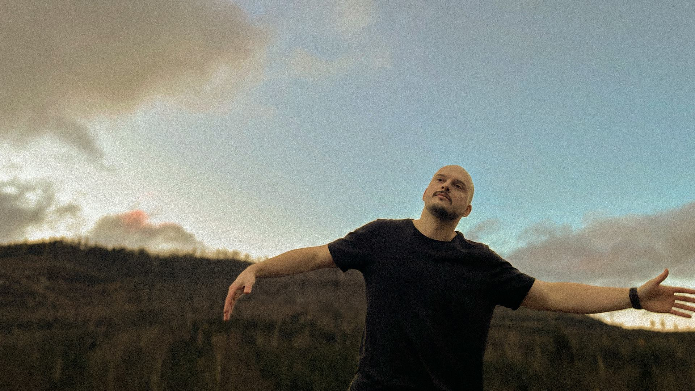

# Сайт — Остап, психолог

Статичний односторінковий сайт. Без збірки, без залежностей.
Відкривається подвійним кліком по `index.html`.

```
site/
├── index.html          структура і весь текст
├── styles.css          оформлення + морф-система
├── script.js           морф, анімації, каруселі, форма
└── assets/
    ├── 1.jpg, 2.jpg…    фото (стиснуті, ~1.5 МБ разом)
    └── certs/           9 дипломів/сертифікатів (стиснуті, ~2.2 МБ разом)
```

Загальний розмір сайту: **~3.7 МБ** (було ~33 МБ до стиснення).

---

## Що реальне, а що ще ні

Весь текстовий контент — біографія, підхід, цінності, список запитів,
9 дипломів з фото, 10 відгуків з реальними іменами, ціна, статистика —
перенесено з твого профілю на **rozmova.me/therapist/ostap-buryak**.
Це не заглушки, це його справжні слова.

### Залишилось зробити руками

**1. Контакти — `script.js`, блок `CONFIG` угорі файлу.**
На rozmova.me особисті контакти (email/telegram/instagram) не публікуються,
тому їх там взяти не вийшло:

```js
var CONFIG = {
  email:     '',   // напр. 'ostap@example.com'
  telegram:  '',   // напр. 'https://t.me/nickname'
  instagram: '',   // напр. 'https://instagram.com/nickname'
  formEndpoint: ''
};
```

Поки порожньо — форма запису показує повідомлення, що вона не підключена.

- **Просто:** вкажи `email` — форма відкриє поштовий клієнт із заповненим листом.
- **Нормально:** зареєструй безкоштовну форму на [formspree.io](https://formspree.io),
  встав отриманий URL у `formEndpoint` — заявки приходитимуть на пошту.

**2. Відгуки — показано 10 з 22.** Решта 12 — на самому rozmova.me
(посилання внизу секції «Відгуки» вже стоїть). Якщо хочеш усі 22 на сайті —
скажи, довантажу.

**3. Диплом другого ступеня гештальт-терапії — «у процесі навчання».**
На rozmova.me так і вказано (288 год, ще не завершено), тому картка в
«Освіті» стоїть без фото — це чесно, а не недогляд.

**4. Формат роботи — тільки онлайн.** На rozmova.me прямо написано
«Фахівець приймає тільки онлайн», тому очний формат з сайту прибрав.
Якщо Остап насправді приймає ще й наживо — скажи, поверну.

---

## Морф-анімація між блоками

Головна вимога — сучасний морф на кожному переході між блоками. Працює так:

- `script.js` рахує для кожної секції прогрес `--p` (0…1) з її позиції у вʼюпорті;
- CSS через `calc()` перетворює це число на геометрію.

Коли блок заходить знизу, він:
1. **звужений з боків** (`inset` 6vw) → розтікається на всю ширину;
2. має **круглі верхні кути** (90px) → кути розпрямляються в 0;
3. трохи **зміщений і зменшений** (0.955) → стає на місце.

Фото в цей же час морфують форму — з органічної «краплі» в геометричну рамку.

Плюс: заголовки виїжджають рядками з-під маски, фонові плями повільно
деформуються, лічильники рахують (1 232 сесії, 1 600 грн), шапка
розмивається при скролі.

**Налаштування швидкості морфу** — `script.js`, функція `update()`:

```js
var raw = clamp((vh - relTop) / (vh * 0.55), 0, 1);
```
`0.55` — на якій частці екрана блок повністю «стає на місце».
Менше число = різкіший морф, більше = плавніший.

**Сила морфу** — `styles.css`, селектор `.block`: значення `6vw`, `90px`, `.955`.

Усі анімації автоматично вимикаються при `prefers-reduced-motion`.

---

## Фон першого блоку

Зараз використано `assets/2.jpg`. Щоб перемкнути на `1.jpg` — `index.html`:

```html

```

Різниця: на `2.jpg` постать справа (текст ліворуч лягає на чисте небо),
на `1.jpg` постать по центру.

Текст першого блоку — це розшифровка `основа.jpg` («Що хочу сказати собі
сьогодні?»), як ти й просив: не картинкою, а текстом.

---

## Що ще варто зробити перед запуском

- [ ] контакти в `script.js` (email / telegram / instagram)
- [ ] favicon (`<link rel="icon" ...>` у `<head>`)
- [ ] реальний домен у `og:image` (зараз відносний шлях — для соцмереж потрібен повний URL)
- [ ] сторінка політики конфіденційності, якщо форма збирає дані
- [ ] перевірити на реальному телефоні

---

## Технічні деталі

- Vanilla HTML/CSS/JS, без фреймворків і збірки
- Шрифти: Playfair Display + Inter (Google Fonts, кирилиця)
- Анімації тільки на `transform` / `opacity` / `clip-path` — не смикається
- Адаптив: 1024px (планшет) і 720px (телефон)
- Доступність: скіп-лінк, `aria`, фокус-стилі, підтримка reduced-motion
- Зображення стиснуті у JPEG (якість 78–82) через .NET System.Drawing
